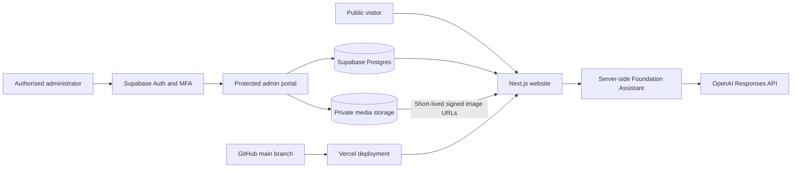

# The Guvnor Ace Foundation Website

The official website and secure content-management system for **The Guvnor Ace Foundation**, a charitable organisation supporting vulnerable children, families and communities in Uganda.

[View the live website](https://www.theguvnoracefoundation.org) · [Donate](https://www.theguvnoracefoundation.org/donate) · [Administrator sign-in](https://www.theguvnoracefoundation.org/admin/login)

## Overview

This repository contains two connected experiences:

- A responsive public website presenting the Foundation’s mission, programmes, impact, policies, donation options and contact details.
- A protected administration portal that lets authorised staff update website wording, photographs, page galleries, donation details and approved visual settings without editing source code.

The application uses hard-coded, reviewed content as a safe fallback. Published Supabase content overrides those defaults when the database is configured and available, so a temporary database issue does not leave the public website empty.

## Main features

### Public website

- Twenty indexable public pages covering the Foundation’s work and policies.
- Clear donation routes through PayPal, GoFundMe and Airtel Money.
- Responsive layouts for desktop, tablet and mobile devices.
- Accessible navigation, semantic headings, skip links, image descriptions and keyboard-visible controls.
- Cookie preference controls and dedicated privacy, accessibility, safeguarding, complaints and donation-refund information.
- SEO metadata, canonical URLs, Open Graph images, structured data, `robots.txt` and an XML sitemap.
- Custom Foundation favicon and search-engine verification metadata.
- An optional Foundation AI assistant for general visitor enquiries.

### Administration portal

Authorised administrators can:

- Sign in through Supabase Authentication with mandatory authenticator-app MFA.
- Edit public wording across all supported website pages.
- Manage page headings, descriptions, buttons and links through a visual editor.
- Update contact details, donation destinations and approved colour or density presets.
- Reorder or hide managed homepage sections.
- Upload, preview, publish, replace, unpublish and delete photographs.
- Click a photograph to replace it directly.
- Add up to 24 photographs to each supported page gallery and reuse one photograph on several pages.
- Record image descriptions, captions, publication consent and safeguarding review status.

Raw React or Next.js code is intentionally not editable through the browser. This prevents an administrator mistake or compromised account from injecting executable code or breaking the production application.

## Technology stack

| Area | Technology |
| --- | --- |
| Application | Next.js 16 App Router, React 19 and TypeScript |
| Styling | Responsive CSS design system with local font configuration |
| Authentication | Supabase Auth with TOTP MFA and AAL2 enforcement |
| Database | Supabase Postgres with Row Level Security |
| Media storage | Private Supabase Storage bucket with short-lived signed URLs |
| Image processing | Sharp |
| AI assistant | OpenAI Responses API |
| Unit tests | Vitest and Testing Library |
| Browser tests | Playwright: Chromium, WebKit and Mobile Safari profiles |
| Hosting | Vercel |
| Continuous integration | GitHub Actions |

## Architecture



Public database reads are restricted to published records. Administrative operations require an authenticated user listed in `admin_users`, a permitted role and an AAL2 MFA session.

## Repository structure

```text
app/                    Next.js routes, metadata, API routes and admin pages
components/             Public, admin, donation, media and privacy components
lib/admin/              Administrator authorisation helpers
lib/cms/                Safe content, visual-editor and media settings
lib/security/           Persistent request-rate limiting
lib/supabase/           Browser, server and session clients
public/                 Static images, icons and video assets
styles/                 Shared design tokens and focused stylesheets
supabase/migrations/    Version-controlled database and security migrations
__tests__/              Unit and component tests
e2e/                    Playwright end-to-end tests
.github/workflows/      GitHub Actions quality and browser-test pipeline
```

## Public routes

| Purpose | Route |
| --- | --- |
| Homepage | `/` |
| About | `/about` |
| Programmes | `/programmes` |
| Impact | `/impact` |
| Stories | `/stories` |
| Get involved | `/get-involved` |
| Volunteer | `/volunteer` |
| Partnerships | `/partnerships` |
| Donate | `/donate` |
| Contact | `/contact` |
| Reports | `/reports` |
| Safeguarding | `/safeguarding` |
| Child protection | `/child-protection` |
| Policies | `/policies` |
| Complaints | `/complaints` |
| Donation and refund policy | `/donation-refund` |
| Privacy | `/privacy` |
| Terms | `/terms` |
| Cookie information | `/cookies` |
| Accessibility | `/accessibility` |

Administration routes begin at `/admin/login`. `/admin`, `/admin/content`, `/admin/media` and `/admin/mfa` are protected.

## Local development

### Prerequisites

- Node.js 20
- npm
- A Supabase project
- Supabase CLI access for applying migrations
- An OpenAI API key if the Foundation Assistant will be enabled

### Installation

```bash
git clone https://github.com/Ronald-ssema/the-guvnor-ace-foundation.git
cd the-guvnor-ace-foundation
npm ci
cp .env.example .env.local
```

Add the required values to `.env.local`, apply the database migrations, then start the development server:

```bash
npm run dev
```

Open [http://localhost:3000](http://localhost:3000).

Never commit `.env.local`, API keys, access tokens, passwords, MFA recovery information or Supabase service-role credentials.

## Environment variables

| Variable | Exposure | Purpose |
| --- | --- | --- |
| `NEXT_PUBLIC_SUPABASE_URL` | Browser-safe | Supabase project URL |
| `NEXT_PUBLIC_SUPABASE_PUBLISHABLE_KEY` | Browser-safe | Supabase publishable key; access remains controlled by RLS |
| `NEXT_PUBLIC_SITE_URL` | Browser-safe | Canonical website origin, normally `https://www.theguvnoracefoundation.org` |
| `OPENAI_API_KEY` | Server only | Enables the Foundation Assistant API route |
| `NEXT_SERVER_ACTIONS_ENCRYPTION_KEY` | Server only | Stable production encryption key for Next.js Server Actions |
| `RATE_LIMIT_SECRET` | Server only | At least 32 random bytes used to anonymise persistent rate-limit identifiers |

Only variables beginning with `NEXT_PUBLIC_` are intentionally exposed to browsers. This application does not require a Supabase service-role key and one must never be added to public code or Vercel client-side variables.

Generate appropriate production secrets with a cryptographically secure password or secret generator. Keep the same `NEXT_SERVER_ACTIONS_ENCRYPTION_KEY` across all instances of one production deployment.

## Supabase setup

Link the repository to the intended Supabase project and apply the committed migrations:

```bash
npx supabase login
npx supabase link --project-ref YOUR_PROJECT_REF
npx supabase db push
```

Use separate Supabase projects for development or staging and production. Apply and test migrations in staging before production.

The migrations create the administration schema, Row Level Security policies, media safeguards, audit logging and persistent rate limiting. The `site-media` bucket is private.

### Provision the first owner

1. Create the person in **Supabase Dashboard → Authentication → Users**.
2. Run the following in the Supabase SQL editor, replacing only the placeholder email:

```sql
insert into public.admin_users (user_id, email, role)
select id, email, 'owner'
from auth.users
where lower(email) = lower('OWNER_EMAIL@example.org')
on conflict (user_id) do update
set email = excluded.email,
    updated_at = now();
```

The statement must affect exactly one row. Only one owner is permitted by the database constraint. Do not put a real administrator email address or Auth UUID in a migration.

### Add an editor

Create the editor in Supabase Authentication, then run:

```sql
insert into public.admin_users (user_id, email, role)
select id, email, 'editor'
from auth.users
where lower(email) = lower('EDITOR_EMAIL@example.org')
on conflict (user_id) do update
set email = excluded.email,
    role = 'editor',
    updated_at = now();
```

Keep the owner role limited to the person accountable for the production website.

## Administrator sign-in and MFA

1. Open `/admin/login` and enter the Supabase administrator email and password.
2. On first sign-in, the application redirects to `/admin/mfa`.
3. Scan the QR code with a trusted authenticator application.
4. Enter the current six-digit verification code.
5. After successful AAL2 verification, open the dashboard, visual website editor or media library.

Database policies require an AAL2 session for protected content. A stolen password-only session cannot read or modify administrative records.

Store MFA recovery procedures securely outside this repository. Removing or resetting a lost factor must be treated as an accountable owner operation in the Supabase Authentication dashboard.

## Media and safeguarding workflow

The upload process accepts JPG, PNG or WebP files up to 5 MB. Before storage, the server:

1. Checks the declared MIME type and the file signature.
2. Decodes the image with strict error handling.
3. Corrects orientation.
4. Resizes it to fit within 2400 × 2400 pixels without enlargement.
5. Converts it to WebP and removes embedded metadata.
6. Stores it in the private `site-media` bucket.

Public pages receive short-lived signed URLs only when the corresponding record is published, consent-confirmed and safeguarding-reviewed. Unpublishing a record prevents new signed URLs from being issued.

Only publish photographs when the Foundation holds suitable individual or parental permission. Avoid naming vulnerable children unnecessarily, provide a meaningful image description and retain supporting consent records in an approved private records system—not in the public repository.

## Security controls

- Supabase Row Level Security on all managed tables.
- Owner and editor allowlist stored in `admin_users`.
- Mandatory TOTP MFA and AAL2 checks for the administration portal.
- Private media storage with publication, consent and safeguarding gates.
- Server-side image validation, conversion and metadata removal.
- Administrative audit-log entries for content and media changes.
- Persistent rate limiting for the Foundation Assistant.
- Same-origin checks, request-size limits and input validation on the AI route.
- Content Security Policy, HSTS, clickjacking protection and restrictive browser permissions.
- No service-role key in the application.
- No raw-code editor in the administration portal.

Security headers are configured in `next.config.ts`. Review them whenever a new third-party script, API or media host is introduced.

## Foundation Assistant

The visitor assistant runs through the server-side `/api/foundation-assistant` route and uses `gpt-5-mini`. The system prompt restricts it to confirmed Foundation information and instructs it not to invent registrations, statistics, partnerships, financial records or programme outcomes.

If `OPENAI_API_KEY` is absent, exhausted or unavailable, the route returns a controlled service-unavailable response and directs visitors to the published contact details. The key is never sent to the browser.

## Quality assurance

Run the complete local quality suite before merging or deploying:

```bash
npm run lint
npx tsc --noEmit
npm run test:run
npx playwright test
npm run build
```

Additional commands:

```bash
npm run test:coverage
npm run generate:favicons
npm run start
```

GitHub Actions runs linting, type checking, unit tests, a high-severity production dependency audit, a production build and Playwright tests on pushes and pull requests targeting `main`.

## Deployment

Production is hosted on Vercel and connected to the GitHub repository.

Recommended release order:

1. Create or update the feature branch.
2. Run all quality checks locally.
3. Push the branch and review the Vercel preview deployment.
4. Apply any new Supabase migrations to staging and verify them.
5. Merge the reviewed change into `main`.
6. Apply approved production database migrations when required.
7. Confirm all production environment variables are configured in Vercel.
8. Verify `/`, `/donate`, `/admin/login`, `/api/health`, an authenticated content edit and an image upload.
9. Check Google Search Console, error monitoring, Supabase backups and the latest GitHub Actions run.

The health endpoint returns `200` with `{ "status": "ok" }` when the required Supabase and rate-limit configuration is present, otherwise it returns `503` with a degraded status.

## SEO and search visibility

The application provides:

- Page-specific titles and descriptions.
- Canonical production URLs.
- Open Graph and social-sharing metadata.
- Organisation and website structured data.
- A Foundation favicon and Apple touch icon.
- `robots.txt` at `/robots.txt`.
- The public sitemap at `/sitemap.xml`.
- Google Search Console verification metadata.

After changing important public content, allow Vercel to deploy and Google to recrawl the sitemap. Search indexing times are controlled by Google and are not immediate.

## Operational maintenance

- Review administrator access and MFA factors regularly.
- Remove access promptly when a staff member no longer needs it.
- Keep production secrets in Vercel and Supabase secret storage.
- Review dependency alerts and automated audit results.
- Monitor `/api/health` and production error logs.
- Maintain tested Supabase backup and restore procedures.
- Review donation destinations after any payment-account change.
- Periodically verify policy wording, contact details and safeguarding information.
- Keep consent evidence and beneficiary records outside the public repository.

## Contributing

Create changes on a focused branch, preserve existing functionality and include tests for behaviour changes. Do not commit generated build output, local environment files, production identifiers or unrelated workspace files.

Before opening a pull request, confirm that linting, type checking, unit tests and the production build pass. Include screenshots or a Vercel preview link for visual changes.

## Licence and use

This repository is maintained for The Guvnor Ace Foundation. No public open-source licence has been granted. Unless a licence is added, the source code and Foundation assets should be treated as proprietary.
